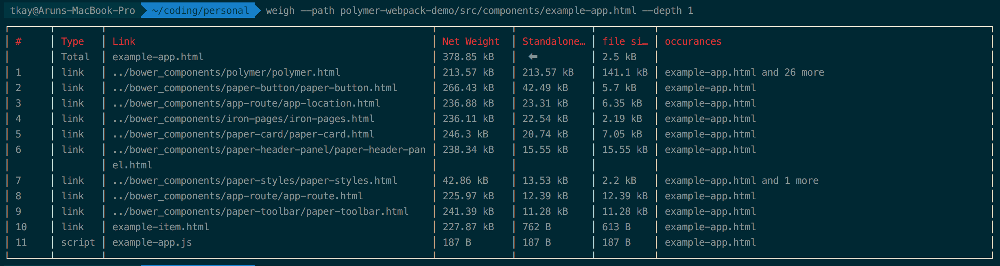

# polymer-weight
size of imported components



## Installation

```sh
npm i -g polymer-weight
weigh --path path/to/file.html
```

More features coming. :)

## TODO

- [x] Deep Scanning of files (walk).
- [ ] Net weight added by component and its children.
- [ ] Show dependency relationship in some way so that user can know which link to remove to reduce size.
- [ ] Handle css imports.
